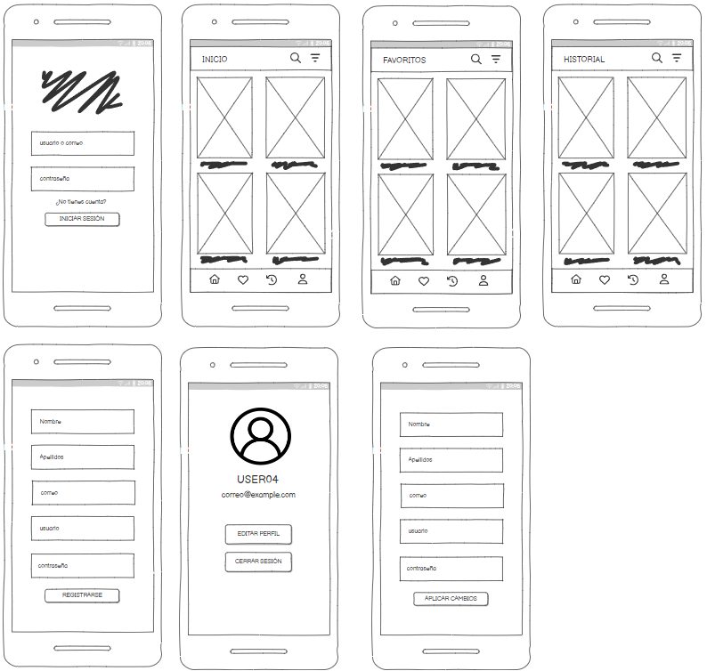

# MyManga

**MyManga** es una aplicación para Android diseñada para gestionar y disfrutar contenido relacionado con mangas. A continuación, se explica el diseño de la interfaz y las funciones de cada pantalla.

## Pantallas de la aplicación

### 1. Pantalla de inicio de sesión
Esta es la primera pantalla que verá el usuario al abrir la aplicación. Sus funciones principales son:
- Ingresar el *usuario* o *correo electrónico* y la *contraseña* para iniciar sesión.
- Botón de registro para crear una cuenta si aún no se tiene.

---

### 2. Pantalla principal (Inicio)
Una vez que el usuario inicia sesión, será llevado a esta pantalla principal. 
- Muestra una cuadrícula de mangas disponibles (con imágenes de portada y nombres debajo).
- Incluye un menú de navegación inferior con cuatro opciones:
  - **Inicio** (icono de casa): Volver a esta pantalla principal.
  - **Favoritos** (icono de corazón): Ver mangas marcados como favoritos.
  - **Historial** (icono de reloj): Acceder al historial de mangas vistos.
  - **Perfil** (icono de usuario): Gestionar la cuenta del usuario.

---

### 3. Pantalla de favoritos
- Muestra una lista de mangas que el usuario ha marcado como favoritos.
- El formato visual es similar al de la pantalla principal, con portadas y nombres de los mangas.

---

### 4. Pantalla de historial
- Aquí se encuentra una lista de mangas que el usuario ha leído o explorado recientemente.
- También utiliza un formato de cuadrícula similar al de favoritos y la pantalla principal.

---

### 5. Pantalla de registro
- Permite a nuevos usuarios crear una cuenta llenando los siguientes campos:
  - Nombre.
  - Apellidos.
  - Correo.
  - Usuario.
  - Contraseña.
- Incluye un botón para completar el registro y crear la cuenta.

---

### 6. Pantalla de perfil
- Muestra información del usuario, como su nombre (ejemplo: USER04) y su correo electrónico.
- Dos opciones principales:
  - **Editar perfil**: Permite modificar los datos del usuario.
  - **Cerrar sesión**: Salir de la aplicación.

---

### 7. Pantalla de edición de perfil
- Desde esta pantalla, el usuario puede actualizar sus datos, incluyendo:
  - Nombre.
  - Apellidos.
  - Correo.
  - Usuario.
  - Contraseña.
- Un botón de "Aplicar cambios" guarda las actualizaciones realizadas.

---

## Navegación general
La aplicación tiene un menú de navegación inferior accesible en varias pantallas que facilita moverse entre las secciones principales: Inicio, Favoritos, Historial y Perfil.

---

¡Gracias por usar **MyManga**! 🎉
