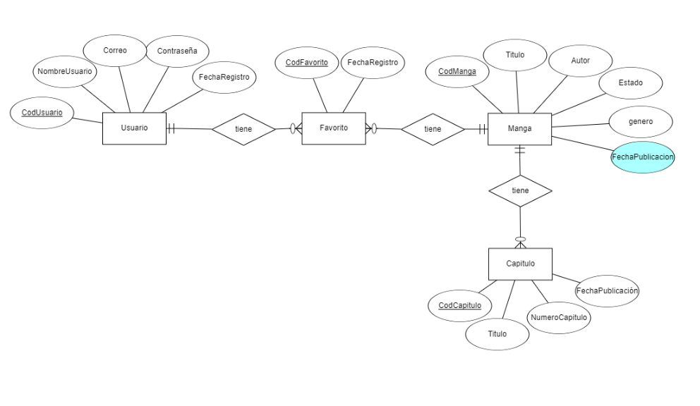
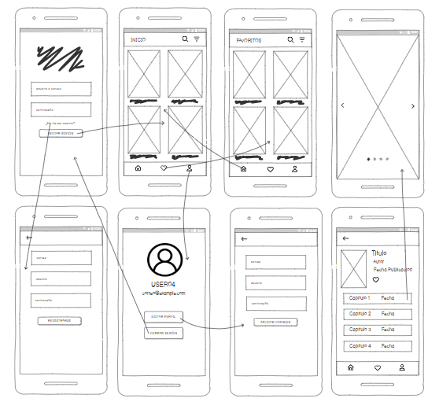

# MyManga

MyManga es una aplicación diseñada para ofrecer a los usuarios una experiencia sencilla y eficiente al leer y administrar sus mangas favoritos. A continuación, se describen las funcionalidades principales basadas en las pantallas mostradas en el wireframe.

---
## Base de Datos Local y Strapi

 
## Diseño Aplicación

 
## Pantallas de la Aplicación

### 1. Pantalla de Inicio
- **Descripción**: Muestra un espacio principal para buscar mangas. Los usuarios pueden ingresar un término en la barra de búsqueda para encontrar el manga que desean.
- **Funciones**:
  - Entrada de texto para búsqueda de mangas.
  - Botón de "Buscar" para iniciar la búsqueda.

### 2. Pantalla de Favoritos
- **Descripción**: Lista de mangas marcados como favoritos por el usuario.
- **Funciones**:
  - Similar al diseño de los resultados de búsqueda, muestra los mangas favoritos en formato de tarjetas.
  - Los usuarios pueden navegar y seleccionar cualquier manga para más detalles.

### 3. Pantalla de Detalles del Manga
- **Descripción**: Muestra la información detallada de un manga seleccionado.
- **Funciones**:
  - Información del manga: título, autor, y fecha de publicación.
  - Lista de capítulos disponibles.
  - Botones interactivos para navegar a capítulos específicos.

### 4. Pantalla de Visualización de Manga
- **Descripción**: Permite a los usuarios leer el contenido de los capítulos del manga seleccionado.
- **Funciones**:
  - Visualización en pantalla completa de las páginas del capítulo.
  - Navegación entre páginas mediante gestos (deslizar izquierda/derecha).
  - Opciones adicionales como zoom para una lectura más cómoda.

### 5. Pantalla de Perfil de Usuario
- **Descripción**: Permite al usuario gestionar su perfil.
- **Funciones**:
  - Visualización del nombre de usuario y correo electrónico.
  - Botón para editar el perfil del usuario.
  - Botón para cerrar sesión.

### 6. Pantalla de Edición de Perfil
- **Descripción**: Los usuarios pueden actualizar su información personal.
- **Funciones**:
  - Campos de texto para editar información como nombre o correo electrónico.
  - Botón para guardar los cambios realizados.
